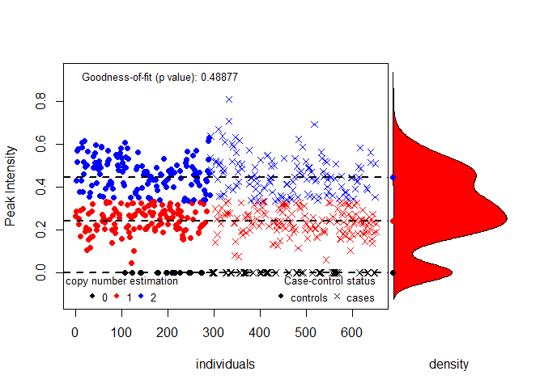

CNVassoc
========

***Association analysis of CNVs and imputed SNPs incorporating uncertainty***

Overview
--------

**CNVassoc** is an R package that carries out analysis of common Copy Number Variants (CNVs) and imputed Single Nucleotide Polymorphisms (SNPs) in population-based studies.

It includes tools for estimating association under a series of study designs (case-control, cohort, etc), using several dependent variables (class status, censored data, counts) as response, adjusting for covariates and considering various inheritance models.

Moreover, it is possible to perform epistasis studies with pairs of CNVs or imputed SNPs.

It has been optimized in order to make feasible the analyses of Genome Wide Association studies (GWAs) with hundreds of thousands of genetic variants (CNVs / imputed SNPs).

Also, it incorporates functions for inferring copy number (CNV genotype calling). Various classes and methods for generic functions (print, summary, plot, anova, ...) have been created to facilitate the analysis.

An extensive [manual](https://github.com/isglobal-brge/CNVassoc/blob/master/CNVassoc_vignette.pdf) describing all **CNVassoc** capabilities with real examples is available in package vignette.

<br>

Package installation
--------------------

Install the **`CNVassoc`** package from Github repository by typing:

``` r
library(devtools)
devtools::install_github(repo = "isglobal-brge/CNVassoc")
```

``` r
library(CNVassoc)
```

Performing accurate association analyses of Copy Number Variants (CNV)
----------------------------------------------------------------------

-   Load example data:

``` r
data(dataMLPA)
```

-   Infer number of copies from probe signal values

``` r
CNV  <-  cnv(x  =  dataMLPA$Gene2,  threshold.0  =  0.01,  mix.method  =  "mixdist")
```

-   Explore signal and copy number inferred

``` r
CNV
```


    Inferred copy number variant by a quantitative signal
       Method: function mix {package: mixdist}  

    -. Number of individuals: 651 
    -. Copies 0, 1, 2 
    -. Estimated means: 0, 0.2435, 0.4469 
    -. Estimated variances: 0, 0.0041, 0.0095 
    -. Estimated proportions: 0.1306, 0.4187, 0.4507 
    -. Goodness-of-fit test: p-value= 0.4887659 


    -. Note: number of classes has been selected using the best BIC

``` r
plot(CNV, case.control = factor(dataMLPA$casco, labels=c("controls", "cases")))
```



``` r
getQualityScore(CNV)
```

    --Probability of good classification: 0.9117571 

-   Association model considering additive effect and adjusting with a covariate

``` r
modadd  <-  CNVassoc(casco  ~  CNV + cov,  data  =  dataMLPA,  model  =  "add")
summary(modadd)
```


    Call:
    CNVassoc(formula = casco ~ CNV + cov, data = dataMLPA, model = "add")

    Deviance: 874.6909 
    Number of parameters: 3 
    Number of individuals: 651 

    Coefficients:
                OR lower.lim upper.lim       SE     stat pvalue
    trend  0.58634   0.45457   0.75631  0.12987 -4.11060  0.000
    cov    0.88435   0.75597   1.03454  0.08003 -1.53566  0.125

    (Dispersion parameter for  binomial  family taken to be  1 )


    Covariance between coefficients:
              intercept CNVadd  cov    
    intercept  0.6825   -0.0222 -0.0643
    CNVadd               0.0169 -0.0001
    cov                          0.0064

Performing efficient association analyses of imputed SNPS
---------------------------------------------------------

-   Import genotype probabilities from example data from SNPTEST software consisting of 500 cases and 500 controls on 200 imputed SNPS.

``` r
fileprobs <- system.file("exdata/SNPTEST.probs", package = "CNVassoc")
```

-   Fit an association model for each imputed SNP

``` r
resp <- resp<-rep(0:1, each = 500)
results <- fastCNVassoc(fileprobs, resp ~ 1, family = "binomial")
```

    Scanning probs data...
    Done! Took  0.07 seconds

-   Adjust p-values by FDR, and show the table by the most significant SNPs

``` r
results$pvalue <- p.adjust(results$pvalue)
head(results[order(results$pvalue),])
```

      variant       beta         se    zscore pvalue iter
    1       1 0.09876790 0.09356268 1.0556335      1    4
    2       2 0.03169991 0.12907826 0.2455867      1    4
    3       3 0.14015045 0.09325322 1.5029020      1    4
    4       4 0.05238862 0.10868034 0.4820432      1    4
    5       5 0.16669646 0.09632587 1.7305471      1    4
    6       6 0.12066040 0.09179177 1.3145013      1    4

References
==========

<p>
Subirana I, Diaz-Uriarte R, Lucas G, Gonzalez JR. <i>CNVassoc: Association analysis of CNV data using R</i>. BMC Med Genomics. 2011 May 24;4:47. doi: 10.1186/1755-8794-4-47. PubMed PMID: 21609482; PubMed Central PMCID: PMC3121578
</p>
<p>
Subirana I, González JR. <i>Genetic association analysis and meta-analysis of imputed SNPs in longitudinal studies</i>. Genet Epidemiol. 2013 Jul;37(5):465-77. doi: 10.1002/gepi.21719. Epub 2013 Apr 17. PubMed PMID: 23595425; PubMed Central PMCID: PMC4273087.
</p>
<p>
Subirana I, González JR. <i>Interaction association analysis of imputed SNPs in case-control and follow-up studies</i>. Genet Epidemiol. 2015 Mar;39(3):185-96. doi: 10.1002/gepi.21883. Epub 2015 Jan 22. PubMed PMID: 25613387.
</p>
