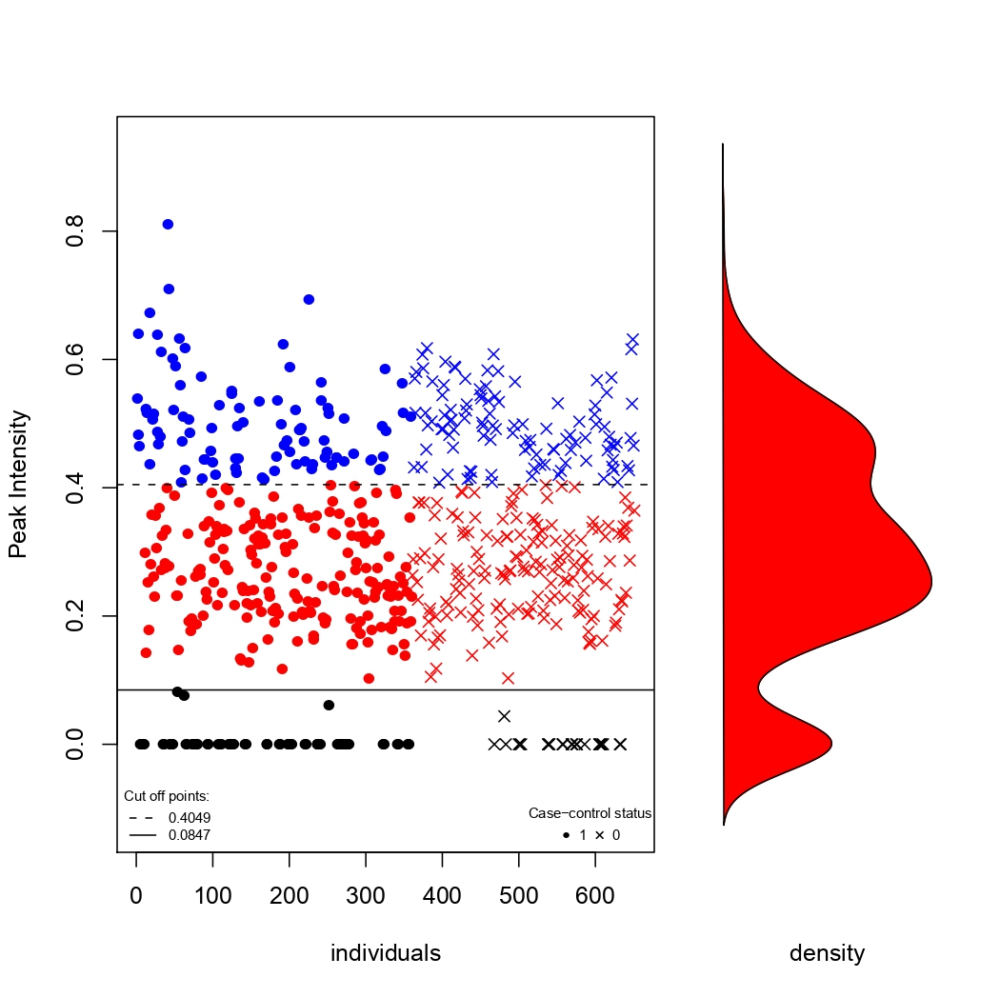

<style>
pre {
  float: left;
  width: 800px;
}
pre.r {
  max-height: none;
}
</style>


```{r setup, include=FALSE}
knitr::opts_chunk$set(echo = TRUE, warning=FALSE, message=FALSE, comment="")
options(width=100)
```


# Introduction

`r Biocpkg("CNVassoc")` allows users to perform association analysis between CNVs and disease incorporating uncertainty of CNV genotype. This document provides an overview on the usage of the `r Biocpkg("CNVassoc")` package. For more detailed information on the model and assumption please refer to article [@GonSubEsc09] and its supplementary material. We illustrate how to analyze CNV data by using some real data sets. The first data set belongs to a case-control study where peak intensities from MLPA assays were obtained for two different genes. The second example corresponds to the Neve dataset [@NevChiFri06] that is available at Bioconductor. The data consists of 50 CGH arrays of 1MB resolution for patients diagnosed with breast cancer. All datasets are available directly from the `r Biocpkg("CNVassoc")` package. Finally, we show examples with Poisson and Weibull-distributed phenotypes.


Start by loading the package `r Biocpkg("CNVassoc")`:


```{r}
library(CNVassoc)
```


and some required libraries

```{r}
library(knitr)
```


# CNV from a single probe   
<!-- \label{section-CNV from a single probe} -->


## The data

In order to illustrate how to assess association between CNV and disease, we use a data set including 360 cases and 291 controls. 
Data is to be published soon as described in [@GonSubEsc09]. The data contains peaks intensities for two genes arising from an MLPA assay.
Note that Illumina or Affymetrix data, where log2 ratios are available instead of peak intensities, 
can be analyzed in the same way as we are illustrating.

The MLPA data set contains case control status as well as two simulated covariates (`quanti` and `cov`) that have been generated 
for illustrative purposes (e.g., association between a quantitative trait and CNV or how to adjust for covariates). 
To load the MLPA data just type


```{r}
data(dataMLPA)
head(dataMLPA)
```


First, we look at the distribution of peak intensities for each of the two genes analyzed: see Figure \@ref(fig:MLPAsignal).


Figure \@ref(fig:MLPAsignal) shows the signals for Gene 1 and Gene 2. For both genes it is clear that there are 3 clusters corresponding to 0, 1 and 2 copies. However, the three peaks for Gene 2 are not so well separated as those of Gene 1 (the underlying distributions overlap much more). This fact leads to more uncertainty when inferring the copy number status for each individual. This will be illustrated in the next section.


```{r MLPAsignal, fig.cap='Signal distributions for Gene 1 and Gene 2'}
par(mfrow=c(2,2),mar=c(3,4,3,1))
hist(dataMLPA$Gene1,main="Gene 1 signal histogram",xlab="",ylab="frequency")
hist(dataMLPA$Gene2,main="Gene 2 signal histogram",xlab="",ylab="frequency")
par(xaxs="i")
plot(density(dataMLPA$Gene1),main="Gene 1 signal density function",xlab="",ylab="density")
plot(density(dataMLPA$Gene2),main="Gene 2 signal density function",xlab="",ylab="density")
```
<!-- \label{fig-MLPAsignal} -->


In the `r Biocpkg("CNVassoc")` package, a function called `plotSignal` has been implemented to plot the peak intensities for a gene.
To illustrate this, a plot of the intensities of Gene 2 for each individual, distinguishing between cases and controls, can be performed by typing (see figure \@ref(fig:plotSignalcasecon))


```{r plotSignalcasecon, fig.cap='Signal distribution for Gene 2 using plotSignal function'}
plotSignal(dataMLPA$Gene2,case.control=dataMLPA$casco)
```

<!-- \label{fig-plotSignalcasecon} -->

or, similarly but correlating the peak intensities with a quantitative phenotype (see figure \@ref(fig:plotSignalquanti)) type

```{r plotSignalquanti, fig.cap='Signal distribution for Gene 2 using plotSignal'}
plotSignal(dataMLPA$Gene2, case.control = dataMLPA$quanti)
```

In figure \@ref(fig:plotSignalquanti), the quantitative phenotype is plotted on the x-axis, instead of distinguishing points by shape, as in figure \@ref(fig:plotSignalcasecon).


Also, it is possible to specify the number of cutoff points and place them interactively via `locator` on the previous plot,
in order to infer the copy number status in a naive way. (More sophisticated ways of inferring copy number status will be dealt with in subsequent sections). To place 2 cutoff points, thereby defining 3 copy number status values or clusters,
(note use of argument `n=2`) and store them as `cutpoints`:


```{r, eval=FALSE}
cutpoints <- plotSignal(dataMLPA$Gene2, case.control = dataMLPA$casco, n = 2)
```




<!-- \label{fig-plotSignalcutoffs} -->


The plot generated in figure \@ref(fig:plotSignalcutoffs) is similar to figure \@ref(fig:plotSignalcasecon), but using colours to distinguish copy number status values inferred from the cutoff points.

In this example, the cutoff points have been placed at:


```{r, echo=FALSE}
cutpoints <- c(0.08470221, 0.40485249)
```


```{r}
cutpoints
```


These stored cutoff points will be used in the following sections.


## Inferring copy number status from signal data}


### From univariate signal intensity

<!-- cnv function using mixdist package -->

The `cnv` function is used to infer the copy number status for each subject using the quantitative signal for an individual probe. This signal can be obtained from any platform (MLPA, Illumina, ...).

This function assumes a normal mixture model as other authors have proposed in the context of aCGH [@PicRobLeb07, @vanKimVos07]. It should be pointed out that in some instances, the intensity distributions (see Gene 1 in Figure \@ref(fig:MLPAsignal)) for a null allele are expected to be equal to 0. Due to experimental noise these intensities can deviate slightly from this theoretical value. For these cases, the normal mixture model fails because the underlying distribution of individuals with 0 copies is not normal. In these situations we fit a modified mixture model (see [@GonSubEsc09] for further details).

Figure \@ref(fig:MLPAsignal) presents two different scenarios. For Gene 1 there are clearly three different status values, but for Gene 2 the situation is not so clear.

Function `cnv` provides various arguments to cope with all these issues. The calling for Gene 1 can be done by executing

```{r}
CNV.1 <- cnv(x = dataMLPA$Gene1, threshold.0 = 0.06, num.class = 3, mix.method = "mixdist")
```


The argument `threshold.0 = 0.06` indicates that individuals with peak intensities lower than 0.06 will have 0 copies. Since there are three underlying copy number status values, we set argument `num.class` to 3. Argument `mix.method` indicates what algorithm to use in estimating the normal mixture model. `"mixdist"` uses a combination of a Newton-type method and the EM algorithm implemented in the `r CRANpkg("mixdist")` library, while `r CRANpkg("mclust")` uses the EM algorithm implemented in the `Mclust` library.

When the exact number of components for the mixture model is unknown (which may be the case for Gene 2), the function uses the Bayesian Information Criteria (BIC) to select the number of components. This is performed when the argument `num.class` is missing. In this case the function estimates the mixture model admitting from 2 up to 6 copy number status values.


```{r}
CNV.2 <- cnv(x = dataMLPA$Gene2, threshold.0 = 0.01, mix.method = "mixdist")
```


As we can see, the best model has a copy number status of 3. This result, obtained by using BIC, is as expected because we already know that this gene has 0, 1 and 2 copies (see [@GonSubEsc09]).


### From other algorithms

The result of applying function `cnv` is an object of class `cnv` that, among other things, contains the posterior probabilities matrix for each individual. This information is then used in the association analysis where the uncertainty is taken into account. Posterior probabilities from any other calling algorithms can also be encapsulated in a `cnv` object to be further used in the analysis.

To illustrate this, we will use the posterior probability matrix that has been computed when inferring copy number for Gene 2 by using the normal mixture model. This information is saved as an attribute for an object of class `cnv`. A function called `getProbs` has been implemented to simplify accessing this attribute. Thus the probability matrix can be saved in an object `probs.2` like this:

```{r}
probs.2 <- getProbs(CNV.2)
```


Imagine that `probs.2` contains posterior probabilities obtained from some calling algorithm such as CANARY (from `PLINK`) or `r Biocpkg("GCHcall")` (this will be further illustrated in Section \@ref(cnv-from-acgh). In this case, we create the object of class `cnv` that will be used in the association step by typing

```{r}
CNV.2probs <- cnv(probs.2)
```


### From predetermined thresholds

Inferring copy number status for Gene 2 from previously specified threshold points (stored in vector `cutpoints`) can be done using
the same `cnv` function but setting the argument `cutoffs` to `cutpoints`.


```{r}
CNV.2th <- cnv(x = dataMLPA$Gene2, cutoffs = cutpoints)
```


Now, the inferred copy number object `CNV.2th` contains the same information as it would if it had been created directly from probabilities.


## Summarizing information
<!-- \label{subsection - Summarizing information} -->

We have implemented two generic functions for an object of class `cnv`. The generic `print` function gives the results on inferred copy number status. It includes the means, variances and proportions of copy number clusters as well as the p value corresponding to the goodness-of-fit test for the selected number of classes.


```{r}
CNV.1
```

and for Gene 2

```{r}
CNV.2
```

This report differs slightly when the object was created from only posterior probabilities:

```{r}
CNV.2probs
```

Figure \@ref(fig:MLPAcnv) shows the result of invoking the generic `plot` function on these objects.


```{r MLPAcnv, fig.cap='Signal distribution by case control, and inferred number of copies'}
plot(CNV.1, case.control = dataMLPA$casco, main = "Gene 1")
plot(CNV.2, case.control = dataMLPA$casco, main = "Gene 2")
```
<!-- \label{fig-MLPAcnv} -->


In figure \@ref(fig:MLPAcnv) the signal is coloured by the inferred (most probable) copy number, while cases and controls are distinguished by shape. This last option is specified by the argument `case.control`. On the right side of the plot, a density function of signal distribution is drawn. The p-value of goodness-of-fit test is the same as this described in the beginning of this section. It indicates whether the assumed normal mixture model (with a given number of components) is correct or not. Notice that for both genes the intensity data fits our the model well (goodness-of-fit p-values > 0.1).


The action of `plot` when only posterior probabilities are available gives a different result (Figure \@ref(fig:MLPAcnvprob)). Two barplots are created for cases and  controls (when argument `case.control` is used). Both are split by the copy number frequency.


```{r MLPAcnvprob, fig.cap='Estimated copy number frequencies for Gene 1 and Gene 2'}
plot(CNV.2probs, case.control=dataMLPA$casco)
```

<!-- \label{fig-MLPAcnvprob} -->


## Measuring uncertainty in inferring copy number status


The function `getQualityScore` uses information from an object of class `cnv` to compute a value that indicates how much the underlying copy number distribution (peak intensities) are mixed or overlapped. The more separated these peaks are (less uncertainty), the larger the quality score is.

Three measures of uncertainty are currently implemented. The first one is the same as that defined in the `r Biocpkg("CNVtools")` package, the second
is the estimated probabilty of good classification (PGC), and the third is defined as the the proportion of individuals with a confidence score (described in [@canary]) bigger than 0.1.

To choose PGC method type

```{r}
CNVassoc::getQualityScore(CNV.1, type = "class")
CNVassoc::getQualityScore(CNV.2, type = "class")
```


To choose the measure defined in the `r Biocpkg("CNVtools")` package:

```{r}
CNVassoc::getQualityScore(CNV.1, type = "CNVtools")
CNVassoc::getQualityScore(CNV.2, type = "CNVtools")
```


And to choose the third measure:

```{r}
CNVassoc::getQualityScore(CNV.1, type = "CANARY")
CNVassoc::getQualityScore(CNV.2, type = "CANARY")
```

It is clear that in Gene 1 there is much less uncertainty, because the PGC is greater than 99%, the measure of `r Biocpkg("CNVtools")` package is higher than 25 (CNVtools recommends a quality score of 4 or larger), or the "CANARY"" measure is almost 0. This fact can also be seen in Figure \@ref(fig:MLPAcnv) where the underlying distributions of signal intensity are very well separated. On the other hand, the PGC for Gene 2 is 91.3%, and the `r Biocpkg("CNVtools")` package value is about 3 indicating that more uncertainty is present, and the "CANARY"" type measure for Gene 2 tells that up to 30% of individuals have a poor confidence score.
When cnv object has been created directly from probabilities (obtained from any other calling algorithm), only `type = "CANARY"` method can be computed. In [@Migen], it is suggested that, when proportion of individuals with confidence score > 0.1 is greater than 10%, this particular CNV should be removed from the analysis under a best-guess strategy in performing the association test.


## Assessing associations between CNV and disease

The function `r Biocpkg("CNVassoc")` carries out association analysis between CNV and disease. This function incorporates calling uncertainty by using a latent class model as described in [@GonSubEsc09]. The function can analyze both binary and quantitative traits. In the first case, a linear regression is performed, and, in the second, a logistic regression. The regression model can be selected by using the argument `case.control`. Nonetheless, the program automatically detects whether or not a quantitative trait is being analyzed so it need not be specified.

The function also allows the user to fit a model with additive or  multiplicative effects of CNV. This can be set through the argument `model`. Possible values are "add" for an additive effect or "mul" for a multiplicative effect.

The function `CNVassoc` returns an object of class `CNVassoc`. This class of object has some properties in common with objects of class `glm`, such as `coef` or `summary` among others.


### Modelling association

The effect of a given CNV on case/control status (`casco` variable) can be fitted by typing

```{r}
model1mul <- CNVassoc(casco ~ CNV.1, data = dataMLPA, model = "mul")
model2mul <- CNVassoc(casco ~ CNV.2, data = dataMLPA, model = "mul")
```


By default, a short summary is printed (similar to `glm` objects)


```{r}
model1mul
```


```{r}
model2mul
```


Note that the coefficients are a matrix with one row per variable and a  column for each distinct copy number status. In this model, because there are no covariates and the CNV has a multiplicative effect, there is just one row (one intercept) and this is different among columns (copy number status).


By using the generic function `summary` we can obtain a more exhaustive output. In particular the odds ratio and its confidence intervals are printed as well as its p-value.


```{r}
summary(model1mul)
```

```{r}
summary(model2mul)
```


By default, `CNVassoc` function treats the response variable as a binary phenotype coded as 0/1. Since `CNVassoc` can handle other distributions such as Poisson or Weibull, the `family` argument must be specified when the response is not distributed as a bernoulli. For instance, to deal with a normally distributed response variable, specify `family="gaussian"`.

The following example presents the case of analyzing a quantitative normally distributed trait and adjusting the association by other covariates:

```{r}
mod <- CNVassoc(quanti ~ CNV.2 + cov, family = "gaussian",
data = dataMLPA, model = 'add', emsteps = 10)
mod
```


Notice that in this case, we use new argument called `emsteps`. This is necessary for computational reasons. Initially performing some preliminary steps using the EM algorithm makes it easier to maximize the likelihood function using the Newton-Raphson procedure. In general, it is enough to perform a few iterations (no more than 10). As usual, the model is then summarized by typing


```{r}
summary(mod)
```


Remember that for quantitative traits we obtain mean differences instead of odds ratios.


### Testing associations

In the previous analysis we obtained p values corresponding to the comparison between every copy number status versus the reference (zero copies). Nonetheless, we are normally interested in testing the overall effect of CNV on disease. We have implemented the Wald test and the likelihood ratio test (LRT) to perform such omnibus testing. Both are available through the function `CNVtest` which requires an object of class {\tt CNVassoc} as the input. To specify the type of test, set the argument `type` to "Wald" or "LRT", respectively. For Gene 1,

```{r}
CNVtest(model1mul, type = "Wald")
CNVtest(model1mul, type = "LRT")
```

and for Gene 2,


```{r}
CNVtest(model2mul, type = "Wald")
CNVtest(model2mul, type = "LRT")
```

Other generic functions like `logLik`, `coef`, `summary` or `update` can be applied to an object of class `CNVassoc` to get more information.

For a multiplicative CNV effect model and for a binary traits, it is possible to change the reference category of copy number status. This can be done by using the argument `ref` when executing the `summary` function. For example, if we want to set one copy as the reference category just type:


```{r}
coef(summary(model1mul, ref = 2))
```


The same kind of results can be obtained if we assume an additive effect of CNV on the trait. In this case we need to set the `model` argument to `"add"`


```{r}
model2add <- CNVassoc(casco ~ CNV.2, data = dataMLPA, model = "add")
model2add
```

Notice that under an additive CNV effect the structure of coefficients are different from the multiplicative CNV effect. Now there are two rows, one for intercept and the other one for the slope (change of risk in increasing by one copy). These two values remain constant for every column (copy number status).


```{r}
summary(model2add)
```


Finally, one might be interested in testing the additive effect. To do this, one can compare both additive and multiplicative models. It is straightforward to see that the additive model is a particular case of the multiplicative one, and therefore the first is nested in the second one.

To compare two nested models we use the generic function `anova` (NOTE: it is only implemented for comparing two models, both fitted with
the `CNVassoc` function).

```{r}
anova(model2mul, model2add)
```


The likelihood ratio test is performed. In this case the p-value is not significant, indicating that an additive CNV effect can be assumed. In any case, one should consider the power of this test before making conclusions.


# CNV from aCGH
<!-- \label{section-CNV from aCGH} -->

The analysis of aCGH data requires taking additional steps into account, due to the dependency across probes and the fact that CNVs are not measured with a unique probe. Table \@ref(tab:stepsCGH) shows four steps we recommend for the analysis of this kind of data. First, posterior probabilities should be obtained with an algorithm that considers probe correlation. We use, in particular, the `r Biocpkg("CGHcall")` package program which includes a mixture model to infer CNV status [@vanKimVos07]. Second, we build blocks/regions of consecutive clones with similar signatures. To perform this step the `r Biocpkg("CGHregions")` package was used [@WieWie07]. Third, the association between the CNV status of blocks and the trait is assessed by incorporating the uncertainty probabilities in `r Biocpkg("CNVassoc")` function. And fourth, corrections for multiple comparisons must be performed. We use the Benjamini-Hochberg(BH) correction [@BenHoc95]. This is a widely used method for control of FDR that is robust in the scenarios commonly found in genomic data [@Reiner].


|          |                       |
|:--------:|:----------------------|
|**Step 1**| Use any aCGH calling procedure that provides posterior: probabilities (uncertainty) (`CGHcall`))|
|**Step 2**| Build blocks/regions of consecutive probes with similar: signatures (`CGHregions`)|
|**Step 3**| Use the signature that occurs most in a block to perform: association (`multiCNVassoc`)|
|**Step 4**| Correct for multiple testing considering dependency: among signatures (`getPvalBH`)|

: (\#tab:stepsCGH) Steps to assess association between CNVs and traits for aCGH.

To illustrate, we apply these steps to the breast cancer data studied by Neve et al. [@NevChiFri06]. The data consists of CGH arrays of 1MB resolution and is available from [Bioconductor](http://www.bioconductor.org/). The authors chose the 50 samples that could be matched to the name tokens of caArrayDB data (June 9th 2007). In this example the association between strogen receptor positivity (dichotomous variable; 0: negative, 1: positive) and CNVs was tested. The original data set contained 2621 probes which were reduced to 459 blocks after the application of `CGHcall` and `CGHregions` functions as we illustrate bellow.

The data is saved in an object called `NeveData`. This object is a list with two components. The first component corresponds to a dataframe containing 2621 rows and 54 columns with aCGH data (4 columns for the annotation and 50 log2ratio intensities). The second component is a vector with the phenotype analyzed (strogen receptor posistivity). The data can be loaded as usual


```{r}
data(NeveData)
intensities <- NeveData$data
pheno <- NeveData$pheno
```


The calling can be performed using `r Biocpkg("CGHcall")` package by using the following instructions:

```{r, eval=FALSE}
######################################################
### chunk number 1: Class of aCGH data
######################################################
library(CGHcall)
Neve <- make_cghRaw(intensities)

######################################################
### chunk number 2: Preprocessing
######################################################
cghdata <- preprocess(Neve, maxmiss = 30, nchrom = 22)

######################################################
### chunk number 3: Normalization
######################################################
norm.cghdata <- normalize(cghdata, method = "median", smoothOutliers = TRUE)

######################################################
### chunk number 4: Segmentation
######################################################
seg.cghdata <- segmentData(norm.cghdata, method = "DNAcopy")

######################################################
### chunk number 5: Calling
######################################################
NeveCalled <- CGHcall(seg.cghdata, nclass = 3)
NeveCalled <- ExpandCGHcall(NeveCalled, seg.cghdata)
```


This process takes about 20 minutes, but to avoid wasting your time, we have saved the final object of class `cghCall` that can be loaded as

```{r}
data(NeveCalled)
```

We can then obtain the posterior probabilities. `CGHcall` function does not estimates the underlying number of copies for each segment but assigns the underlying status: loss, normal or gain. For each segment and for each individual we obtain three posterior probabilities corresponding to each of these three statuses. This is done by executing

```{r}
probs <- getProbs(NeveCalled)
```


This is a dataframe that looks like this:


```{r}
probs[1:5, 1:7]
```


This table can be read as following. The probability that the  individual `X600MOE` is normal for the signature `r probs[1,1]` is `r probs[1,6]`, while the probability of having a gain is `r probs[1,7]` and `r probs[1,5]` of having a loss.

In order to determine the regions that are recurrent or common among samples, we use the `CGHregions` function that takes an object of class `cghCall` (e.g. object `NeveCalled` in our case). This algorithm reduces the initial table to a smaller matrix that contains regions rather than individual probes. The regions consist of consequtive clones with similar signatures [@WieWie07].
This can be done by executing


```{r, eval=FALSE}
library(CGHregions)
NeveRegions <- CGHregions(NeveCalled)
```


This process takes about 3 minutes. We have stored the result in the object `NeveRegions` that can be loaded as usual


```{r}
data(NeveRegions)
```


Now we have to get the posterior probabilities for each block/region. This can be done by typing


```{r}
probsRegions <- getProbsRegions(probs, NeveRegions, intensities)
```

Finally, the association analysis between each region and the strogen receptor positivity can be analyzed by using the `multiCNVassoc` function. This function repeatedly calls `CNVassoc` returning the p-value of association for each block/region


```{r}
pvals <- multiCNVassoc(probsRegions, formula = "pheno ~ CNV", model = "mult", num.copies = 0:2, cnv.tol = 0.01)
```


Notice that the arguments of `multiCNVassoc` function are the same as those of `CNVassoc`. In this example, we have set the argument `num.copies` equal to 0, 1, and 2 that corresponds to "loss", "normal", "gain" status used in the `CGHcall` function.

Multiple comparisons can be addressed by using the Benjamini & Hochberg approach [@BenHoc95]. The function `getPvalBH` produces the FDR-adjusted p-values


```{r}
pvalsBH <- getPvalBH(pvals)
head(pvalsBH)
```


Table 6 in [@GonSubEsc09] can be obtained by typing


```{r}
cumsum(table(cut(pvalsBH[, 2], c(-Inf, 1e-5, 1e-4, 1e-3, 1e-2, 0.05))))
```


# Imputed data (SNPTEST format)


In this section we will show how `r Biocpkg("CNVassoc")` can also be used to analyse SNP data when the SNPs have been imputed or genotyped with some degree of error. Notice that the same procedure can be applied to analyze data from Birdsuite/Canary software (developed by Broad Institute and available on [http://www.broadinstitute.org/](http://www.broadinstitute.org/)). An example from SNPTEST software (available on [https://mathgen.stats.ox.ac.uk/genetics_software/snptest/snptest.html](https://mathgen.stats.ox.ac.uk/genetics_software/snptest/snptest.html)) has been incorporated in the `r Biocpkg("CNVassoc")` package, but in the same format as used by IMPUTE software (downloable from SNPTEST website). IMPUTE is a program to infer a set non observed SNPs from other that have been genotyped, using linkage desequilibrium and other information, usually from the HapMap project ([http://snp.cshl.org](http://snp.cshl.org/)).
The data of the following example can be downloaded freely from the SNPTEST software website, and consists of a set of 500 cases and 500 controls, and 100 SNPs. For all of the SNPs the probabilities of each genotype is given, not the genotype itself, simulating having been obtained from IMPUTE.

Let's load the data. There are 2 data frames, one for cases and the other for controls. For this example we have selected 50 of the 100 imputed SNPS, and the names of the SNPs have been masked, as also the name of the disease.


```{r}
data(SNPTEST)
dim(cases)
dim(controls)
```

```{r}
cases[1:10,1:11]
```

```{r}
controls[1:10,1:11]
```


The structure of the data is as follows:

- every row is a SNP
- the first 3 columns are the SNP identification codes,
- the 4th and 5th are the alleles.
- columns 6 through to the end provide the probabilities of each genotype, each group of 3 columns corresponds to one individual.


For example, the first individual in the data set of cases has probabilities of `r round(cases[1,6],4)`, `r round(cases[1,7],4)` and `r round(cases[1,8],4)` of having the genotypes for the first SNP of `r paste(cases[1,4],cases[1,4],sep="")`, `r paste(cases[1,4],cases[1,5],sep="")` and `r paste(cases[1,5],cases[1,5],sep="")` respectively. And the second individual has a probabilities of `r round(cases[2,9],4)`, `r round(cases[2,10],4)` and `r round(cases[2,11],4)` of having the genotypes for the second SNP of `r paste(cases[2,4],cases[2,4],sep="")`, `r paste(cases[2,4],cases[2,5],sep="")` and `r paste(cases[2,5],cases[2,5],sep="")` respectively.

Of course, cases and controls must have the same number of rows, because the $i$-th row of cases and the $i$-th row of controls correspond to the same SNP.

First in order to use `r Biocpkg("CNVassoc")` certain preliminary data management steps are needed. The goal is to have one matrix of probabilities with 3 columns corresponding to the 3 genotypes and 1000 individuals (500 cases plus 500 controls), for each of the 50 SNPs.


```{r}
nSNP <- nrow(cases)
probs <- lapply(1:nSNP, function(i) {
  snpi.cases <- matrix(as.double(cases[i, 6:ncol(cases)]), ncol = 3, byrow = TRUE)
  snpi.controls <- matrix(as.double(controls[i, 6:ncol(controls)]), ncol = 3, byrow = TRUE)
  return(rbind(snpi.cases, snpi.controls))
})
```


Now `probs` is a list of 50 components, each one containing the probability matrix of each SNP, and the first 500 rows of each matrix refers to the cases and the rest to the controls.

In this point, we can use `multiCNVassoc` as shown in section \@ref(cnv-from-acgh), to perform an association test of each SNP with case control status. But first, a casecontrol variable must be defined, which, in this example, will be a simple vector of 500 ones and 500 zeros.


```{r}
casecon <- rep(1:0, c(500, 500))
```


Now, we have the data ready to fit a model. For example, to compute the association p-value between every SNP and case control status assuming an additive effect:

```{r}
pvals <- multiCNVassoc(probs, formula = "casecon~CNV", model = "add",
num.copies = 0:2, cnv.tol = 0.001)
```


And, as in section \@ref(cnv-from-acgh), it is necessary to correct for multiple tests:


```{r}
pvalsBH <- getPvalBH(pvals)
head(pvalsBH)
```


A frecuency tabulation of how many SNP achieve different levels of significance is obtained by:

```{r}
table(cut(pvalsBH[, 2], c(-Inf, 1e-3, 1e-2, 0.05, 0.1, Inf)))
```


From these results, no SNP appears to be associated with case control status.


# Other phenotype distributions


The examples of the previous section dealt with continuous normally distributed phenotypes, and binary traits. However, there are situations where we may be interested in associating CNV with a phenotype that is not normally distributed, or which is not a binary trait.


## Poisson distributed phenotype


One example of a phenotype that doesn't fit with previous examples is a counting process, that could be the number of times that a patient replapses from a specific cancer. This could be modelled with a Poisson distribution.

`r Biocpkg("CNVassoc")` incorporates the possibility to fit a Poisson distribution by specifying `family = "poisson"`. Also, `r Biocpkg("CNVassoc")` has a function to simulate CNV data and Poisson phenotype. Therefore, in this section simulated data from this function will be analysed.

Data for 4,000 individuals has been simulated under the following scenario:

- CNV copy number of 0, 1 and 2 with probabilities of 0.25, 0.5 and 0.25 respectively,
-  CNV intensity signal means of 0, 1 and 2 for 0, 1 and 2 copies respectively,
-  CNV intensity signal standard deviation of 0.4 for each copy,
-  an additive effect with a risk ratio of 1.7 for each increment in copy number status,
-  incidence of 0.12 of relapsing among individuals with zero copies (which means a probability of `r round(1-dpois(0,1.12),4)` of having at least one relapse).


```{r}
set.seed(123456)
rr <- 1.7
incid0 <- 0.12
lambda <- c(incid0, incid0 * rr, incid0 * rr^2)
dsim <- simCNVdataPois(n = 4000, mu.surrog = 0:2, sd.surrog = rep(0.4, 3),
w = c(0.25, 0.5, 0.25), lambda = lambda)
head(dsim)
```


The result is a data frame with 3 variables, and as many rows as individuals. The description of these variables is:

- `resp`: response, distributed as a Poisson given the copy number status,
- `cnv`: the real copy number status, which, in practice, will be unknown and not considered in testing the association,
- `surrog`: the CNV intensity signal.


First an object of class `cnv` is obtained fitting a normal mixture to the intensity signal. Note that to make the normal mixture converge "mclust" method is specified:

```{r}
CNV <- cnv(dsim$surrog, mix = "mclust")
CNV
```

Then, an association model with CNV and the phenotype assuming an additive effect is performed as usual, but specifying `family="poisson"` in the call to function `CNVassoc`:

```{r}
fit <- CNVassoc(resp ~ CNV, data = dsim, family = "poisson", model = "add")
coef(summary(fit))
```


The same generic functions are appliable as for normal and binary traits. Note that, now, `summary` prints "RR" instead of "OR".

We can compare this to the "gold standard" model, where the phenotype is regressed to the true copy number status:

```{r}
fit.gold <- glm(resp ~ cnv, data = dsim, family = "poisson")
table.gold <- c(exp(c(coef(fit.gold)[2], confint(fit.gold)[2,])),
coef(summary(fit.gold))[2,4])
names(table.gold) <- c("RR", "lower", "upper", "p-value")
table.gold
```


The confidence interval of the estimate contains the true relative risk, and the "gold standard" model gives similar results as the one fitted using `CNVassoc` function (latent class model).


Because the data has been simulated from a fixed scenario, we may be interested in comparing with an estimation made under a naive strategy, i.e. compared to fitting a standard log-linear Poisson model assigning the most probable copy number to each individual (best guess approach):


```{r}
fit.naive <- glm(resp ~ CNV, data = dsim, family = "poisson")
table.naive <- c(exp(c(coef(fit.naive)[2], confint(fit.naive)[2,])),
coef(summary(fit.naive))[2,4])
names(table.naive) <- c("RR", "lower", "upper", "p-value")
table.naive
```

To sum up, table \@ref(tab:compare) gives the relative risk estimated under different models (gold standard, latent class and naive):

```{r compare}
taula <- rbind(
  table.gold[1:3],
  coef(summary(fit))[,c("RR","lower.lim","upper.lim")],
  table.naive[1:3]
)
rownames(taula)<-c("Gold","LC","Naive")
knitr::kable(taula, caption = "Comparison of RR estimated by the gold standard model, a latent class model (LC) and naive approach")
```


## Weibull distributed phenotype


Similarly to a Poisson distributed phenotype, we may be interested in fitting data that comes from a followed cohort, where we want to estimate associations of time to death or onset of a particular disease with copy number variant. Probably some individuals will be censored, i.e. at the end of follow-up they are alive or free of disease. As for classical survival analysis is important to take into account these censored individuals and not to remove them from the analysis.

Function `CNVassoc` can handle this situation, simply by specifying `family}="weibull"` rather than poisson or gaussian. In considering censoring status, function `Surv` must be invoked in the left hand term of the formula argument (as for `coxph` function for example).

In this subsection we illustrate how to fit a model with time to event, possibly censored, by fitting simulated data, in a similar manner to the previous subsection (Poisson distributed phenotype), and using function `simCNVdataWeibull` implemented in the `r Biocpkg("CNVassoc")` package.

The following scenario has been simulated for 5000 individuals:

-  CNV copy number of 0, 1 and 2 with probabilities of 0.25, 0.5 and 0.25 respectively,
-  CNV intensity signal means of 0, 1 and 2 for 0, 1 and 2 copies respectively,
-  CNV intensity signal standard deviation of 0.4 for each copy,
-  an additive effect with a hazard ratio of 1.5 for each increment of copy number status
-  shape parameter of the weibull distribution equal to one,
-  disease incidence equal to 0.05 (per person-year) among the population with zero copies.
-  proportion of non-censored individuals (who suffered the disease during the study) of 10%.

```{r}
set.seed(123456)
n <- 5000
w <- c(0.25, 0.5, 0.25)
mu.surrog <- 0:2
sd.surrog <- rep(0.4, 3)
hr <- 1.5
incid0 <- 0.05
lambda <- c(incid0, incid0 * hr, incid0 * hr^2)
shape <- 1
scale <- lambda^(-1/shape)
perc.obs <- 0.10
time.cens <- qweibull(perc.obs, mean(shape), mean(scale))
dsim <- simCNVdataWeibull(n, mu.surrog, sd.surrog, w, lambda, shape, time.cens)
head(dsim)
```


The result is a data frame with 4 variables (one additional variable, compared to the Poisson example, that corresponds to censoring indicator), and, as before, as many rows as individuals:

- `resp`: time to disease (weibull distributed) or censoring (end of follow-up),
- `cens`: censoring indicator (0: without disease at the end of follow-up period, 1: with disease within the follow-up period),
- `cnv`: the real copy number status, which, in practice, will be unknown and not considered in testing the association,
- `surrog`: the CNV intensity signal.

As before, the CNV signal is fitted under a normal mixture distribution with function `cnv` and specifying the "mclust" method:

```{r}
CNV<-cnv(dsim$surrog,mix="mclust")
CNV
```


Then, an association model with CNV and the phenotype assuming an additive effect is performed as usual, this time specifying `family="weibull"`, and introducing the censored status using function `Surv` in the left hand side of the formula argument:


```{r}
fit <- CNVassoc(Surv(resp,cens)~CNV, data=dsim, family="weibull", model="add")
coef(summary(fit))
```


Again, the same generic functions are applicable as for normal, binary traits and poisson distributed phenotype. Note that, now, `summary` prints "HR" instead of "OR" (binary) or "RR" (poisson).


# References


